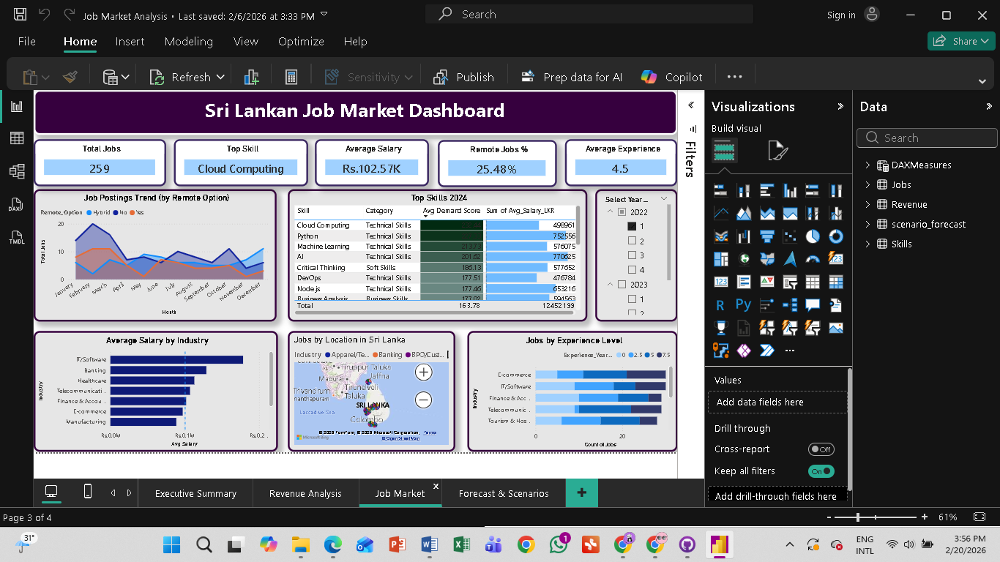

# 📊 Sri Lankan Job Market Analysis
### Time Series Forecasting & Market Demand Trend Analysis (2022-2024)

> A comprehensive data analysis project examining recruitment market trends, revenue forecasting, and skills demand in Sri Lanka's outsourcing and recruitment industry.

---


## 🎯 Overview

This project analyzes the **Sri Lankan recruitment and job market** from 2022-2024, covering:
- Historical revenue patterns and seasonality analysis
- Time series forecasting using Prophet
- Economic indicators integration (GDP growth, unemployment rates)
- Scenario planning (best case, most likely, worst case forecasts)
- Job market insights including emerging roles and in-demand skills

**Project Context:** Internship project analyzing market demand trends to support strategic decision-making for recruitment agencies and outsourcing firms.

---

## ✨ Features

### 📈 Data Analysis
- ✅ **Data Cleaning & Preprocessing** - Automated data quality checks and cleaning
- ✅ **Exploratory Data Analysis (EDA)** - Comprehensive statistical analysis
- ✅ **Seasonality Detection** - Monthly and quarterly trend identification
- ✅ **Correlation Analysis** - Economic indicators vs revenue relationships

### 🔮 Forecasting Models
- ✅ **Prophet Model** - Facebook's time series forecasting with regressors
- ✅ **Model Validation** - MAE, RMSE, MAPE metrics on test data
- ✅ **6-Month Forecasts** - Future revenue predictions with confidence intervals

### 📊 Interactive Dashboard
- ✅ **4-Page Power BI Dashboard** - Executive summary, revenue analysis, job insights, forecasts
- ✅ **20+ DAX Measures** - Custom calculations and KPIs
- ✅ **Dynamic Filtering** - Year, quarter, month and industry slicers
- ✅ **Scenario Visualization** - Best/Most Likely/Worst case comparisons

### 🎨 Visualizations
- Revenue trends and growth rates
- Industry performance breakdown
- Top job roles and skills demand
- Salary analysis by industry
- Geographic distribution of jobs
- Forecast scenarios comparison

---

## 🛠️ Technologies Used

### Programming & Analysis
Python
Pandas
NumPy
Jupyter

### Machine Learning & Forecasting
- **Prophet** - Time series forecasting
- **Statsmodels** - Statistical modeling
- **Scikit-learn** - Model validation metrics

### Visualization & BI
Power BI
Matplotlib
Seaborn

### Data Tools
- **Excel** - Data storage and interchange
- **OpenPyXL** - Excel file handling
- **DAX** - Power BI calculations

---

## 📁 Project Structure

```
srilanka-job-market-analysis/
│
├── data/
│   ├── raw/                                    # Original datasets
│   │   ├── srilanka_job_market_data.csv
│   │   ├── srilanka_recruitment_revenue_data.csv
│   │   └── srilanka_skills_demand_data.csv
│   │
│   ├── cleaned/                                # Cleaned datasets
│   │   ├── 
│   │   ├── 
│   │
│   └── processed/                              # Analysis outputs
│       ├── 
│       └── 
│
├── notebooks/
│   └── JobMarket_Analysis.ipynb                # Main Jupyter notebook
│
├── powerbi/
│   ├── JobMarket_Dashboard.pbix                # Power BI dashboard file
│
├── outputs/
│   ├── charts/                                 # Generated visualizations
│   │   ├── 
│   │   ├── 
│   │
│   └── reports/
│       └──                     # Comprehensive reports                
│
├── images/                                      # dashboard images
│   └── dashboard.png
│
└── README.md                                    # This file                                    
```

---

## 🚀 Installation

### Prerequisites

- Python 3.8 or higher
- Anaconda (recommended) or pip
- Power BI Desktop (for dashboard)
- Git

### Step 1: Clone Repository

```bash
git clone https://github.com/nisansalasandu/srilanka-job-market-analysis.git
cd srilanka-job-market-analysis
```

### Step 2: Create Virtual Environment

**Using Conda (Recommended):**
```bash
conda create -n jobmarket python=3.9
conda activate jobmarket
```

**Using venv:**
```bash
python -m venv venv
source venv/bin/activate
# On Windows: venv\Scripts\activate
```

### Step 3: Install Dependencies

```bash
pip install -r requirements.txt
```

**requirements.txt:**
```
pandas>=1.5.0
numpy>=1.23.0
matplotlib>=3.6.0
seaborn>=0.12.0
prophet>=1.1.0
statsmodels>=0.14.0
scikit-learn>=1.2.0
openpyxl>=3.1.0
jupyter>=1.0.0
```

### Step 4: Install Power BI Desktop

Download from: [https://powerbi.microsoft.com/desktop/](https://powerbi.microsoft.com/desktop/)

---

## 💻 Usage

### Running the Analysis

**Jupyter Notebook (Recommended)**

```bash
# Start Jupyter
jupyter notebook

# Open notebooks/JobMarket_Analysis.ipynb
# Run all cells (Cell → Run All)
```


### Viewing the Dashboard

1. Open Power BI Desktop
2. File → Open → `powerbi/JobMarket_Dashboard.pbix`
3. Interact with slicers and visuals

### Generating Reports

All outputs are automatically saved to:
- Charts: `outputs/charts/`
- Data: `data/processed/`
- Reports: `outputs/reports/`

---

## 📊 Data Analysis

### Datasets Overview

| Dataset | Records | Columns | Description |
|---------|---------|---------|-------------|
| **Job Market Data** | 600 | 12 | Job postings, roles, salaries, industries |
| **Revenue Data** | 36 | 20 | Monthly revenue, placements, economic indicators |
| **Skills Demand** | 540 | 12 | Quarterly skills tracking and demand scores |

### Data Cleaning Process

✅ **Quality Checks:**
- Missing value detection and handling
- Duplicate removal
- Data type validation
- Outlier detection

✅ **Transformations:**
- Date standardization
- Text normalization
- Numeric validation
- Feature engineering (Year, Quarter, Month)

✅ **Validation:**
- Cross-table consistency checks
- Date range validation
- Statistical sanity checks

### Analysis Workflow

```
Raw Data → Data Cleaning → EDA → Feature Engineering
    ↓
Historical Analysis → Seasonality Detection → Trend Analysis
    ↓
Model Building → Prophet/SARIMA → Validation → Forecasting
    ↓
Scenario Analysis → Best/Likely/Worst Cases → Recommendations
    ↓
Visualization → Power BI Dashboard → Reporting
```

---

## 📈 Dashboard

### Page 1: Executive Summary
- **KPIs:** Total Revenue, Placements, Jobs, Profit Margin
- **Charts:** Revenue trend, Industry distribution, Top roles
- **Filters:** Year, Quarter, Industry


### Page 2: Revenue Analysis
- Monthly revenue comparison (by year)
- Industry performance matrix
- Profitability trends
- Economic indicators correlation


### Page 3: Job Market Insights
- Job posting trends over time
- Salary analysis by industry
- Top skills demand (2024)
- Geographic distribution
- Experience level breakdown

 

### Page 4: Forecast & Scenarios
- 6-month revenue forecasts
- Scenario comparison (Best/Likely/Worst)
- Monthly forecast breakdown
- Assumptions


### DAX Measures Examples

```dax
// Total Revenue
Total Revenue = SUM(Revenue[Total_Revenue_LKR])

// Year-over-Year Growth
YoY Growth % = 
VAR CurrentYear = [Total Revenue]
VAR PreviousYear = 
    CALCULATE([Total Revenue], SAMEPERIODLASTYEAR(Revenue[Date]))
RETURN
    DIVIDE(CurrentYear - PreviousYear, PreviousYear, 0) * 100

// 3-Month Moving Average
3M Moving Avg = 
AVERAGEX(
    DATESINPERIOD(Revenue[Date], LASTDATE(Revenue[Date]), -3, MONTH),
    [Total Revenue]
)
```

---

## 🔍 Key Findings

### Historical Insights

📌 **Revenue Growth:**
- 2022: Economic crisis impact (-7.8% GDP growth)
- 2023: Recovery phase (+15.2% YoY revenue growth)
- 2024: Sustained growth (+8.7% YoY revenue growth)

📌 **Seasonality Patterns:**
- **Strongest:** Q1 (Jan-Mar) and Q3 (Jul-Sep)
- **Weakest:** April (Sinhala New Year) and December (year-end)
- Average monthly revenue: LKR 12.5M

📌 **Industry Performance:**
- **Top 3 Industries:** IT/Software (35%), BPO (28%), Finance (18%)
- IT sector shows highest growth trajectory
- BPO remains stable with consistent demand

### Job Market Trends

📌 **Most In-Demand Roles:**
1. Software Engineer
2. Data Analyst
3. Business Development Executive
4. Customer Service Representative
5. Accountant

📌 **Skills Demand (2024):**
- **Technical:** Python, SQL, Power BI, AWS, React
- **Business:** Data Analysis, Project Management, Sales
- **Soft Skills:** Communication, Problem-solving, Teamwork

📌 **Salary Insights:**
- Average salary: LKR 95,000/month
- Highest paying: IT/Software (LKR 150,000)
- Experience premium: +25% for 5+ years

### Forecast Results

📌 **6-Month Projection (Jan-Jun 2025):**
- **Best Case:** LKR 95.2M total (+8% monthly growth)
- **Most Likely:** LKR 82.5M total (Prophet model)
- **Worst Case:** LKR 71.8M total (+1% monthly growth)

📌 **Model Accuracy:**
- Prophet MAPE: 8.3% (Excellent)
- Includes GDP growth and unemployment regressors
- Validated on 20% holdout test set

---

## 🎯 Recommendations

### For Recruitment Agencies

1. **Focus on IT/Software** - Highest growth sector with premium placements
2. **Q1 & Q3 Push** - Intensify marketing during peak seasons
3. **Skills Development** - Partner with training providers for Python, SQL, Power BI
4. **Remote Opportunities** - 35% of jobs offer remote work - promote this

### For Job Seekers

1. **Upskill in Data** - Data analysis skills show highest demand growth
2. **Target IT Sector** - Best salary prospects and job availability
3. **Gain Experience** - 3-5 years experience shows optimal job availability
4. **Remote Work** - Consider remote-friendly roles for flexibility

### For Business Strategy

1. **Diversify Beyond IT** - Healthcare and E-commerce show emerging potential
2. **Monitor Economic Indicators** - GDP growth correlates strongly with revenue
3. **Seasonal Staffing** - Adjust recruitment team size for Q1/Q3 peaks
4. **Client Retention** - Focus on profitability (current margin: 18.5%)

---

## 🔮 Future Enhancements

### Planned Features

- [ ] Real-time data integration via APIs
- [ ] Machine learning classification for job roles
- [ ] Sentiment analysis on job descriptions
- [ ] Salary prediction model
- [ ] Interactive web dashboard (Streamlit/Dash)
- [ ] Automated monthly reporting
- [ ] Comparison with regional markets (India, Philippines)

### Technical Improvements

- [ ] Docker containerization
- [ ] CI/CD pipeline setup
- [ ] Unit tests for data processing
- [ ] Database integration (PostgreSQL)
- [ ] REST API for forecasts


---

## 🤝 Contributing

Contributions are welcome! Please follow these steps:

1. Fork the repository
2. Create a feature branch (`git checkout -b feature/AmazingFeature`)
3. Commit your changes (`git commit -m 'Add some AmazingFeature'`)
4. Push to the branch (`git push origin feature/AmazingFeature`)
5. Open a Pull Request


---

## 📧 Contact

**Your Name**
- LinkedIn: [https://www.linkedin.com/in/nisansala-ruwan-pathirana-602a2a2a6/](https://www.linkedin.com/in/nisansala-ruwan-pathirana-602a2a2a6/))
- Email: nisansala.ruwanpathirana0@gmail.com
- GitHub: [@nisansalasandu](https://github.com/nisansalasandu)

**Project Link:** [https://github.com/nisansalasandu/srilanka-job-market-analysis](https://github.com/nisansalasandu/srilanka-job-market-analysis)

---

## 🙏 Acknowledgments

- **Power BI Community** - Dashboard inspiration and best practices
- **Stack Overflow Community** - Technical problem-solving support


---

## 📈 Project Metrics

| Metric | Value |
|--------|-------|
| **Lines of Code** | ~2,500 |
| **Data Points Analyzed** | 1,176+ |
| **Visualizations Created** | 25+ |
| **DAX Measures** | 20+ |
| **Project Duration** | 2 weeks |
| **Forecast Accuracy** | 8.3% MAPE |

---

## 🎓 Learning Outcomes

Through this project, I developed expertise in:

- ✅ Data cleaning and preprocessing workflows
- ✅ Time series analysis and forecasting techniques
- ✅ Prophet model implementation
- ✅ Power BI dashboard design and DAX programming
- ✅ Business intelligence and data storytelling
- ✅ Economic indicators integration in forecasting
- ✅ Scenario planning and risk analysis
- ✅ Professional project documentation

---

<div align="center">

### ⭐ If you found this project helpful, please consider giving it a star!

**Nisansala Ruwan pathirana ❤️**

[⬆ Back to Top](#-sri-lankan-job-market-analysis)

</div>
